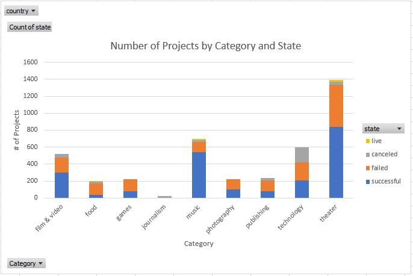
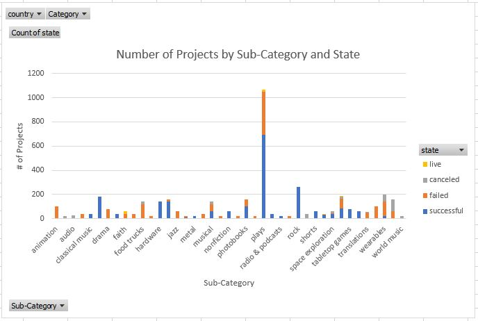
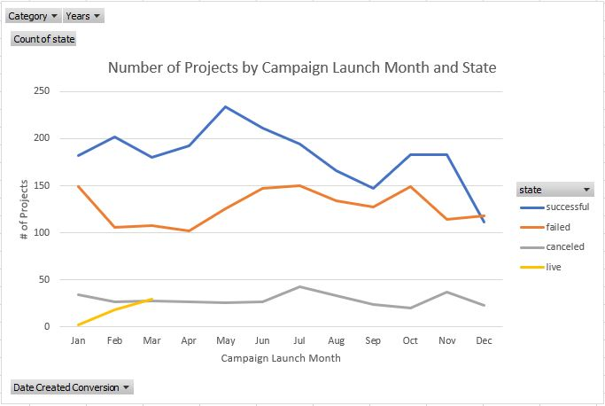
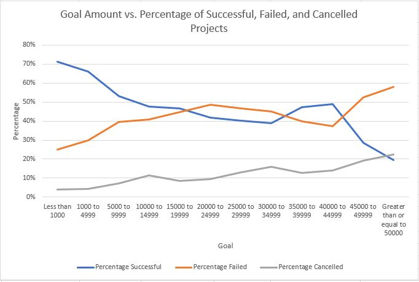

# Kickstart My Chart

## **Objective:**
The objective of this project is to use conditional formatting, formulas, pivot tables, and pivot charts in Excel to modify and analyze the data of 4,000 past Kickstarter projects to uncover potential market trends. Since Kickstarter is a crowdfunding service, the dataset includes information such as funding goal, percent funded, average donation, currency, country, and category. 

The following graphs were created:
* Number of Projects by Category and State
* Number of Projects by Sub-Category and State
* Number of Projects by Campaign Launch Month and State
* Goal Amount vs. Percentage of Successful, Failed, and Cancelled Projects

## **Tools:**
1. Excel

## **Screenshots (Graphs):**

